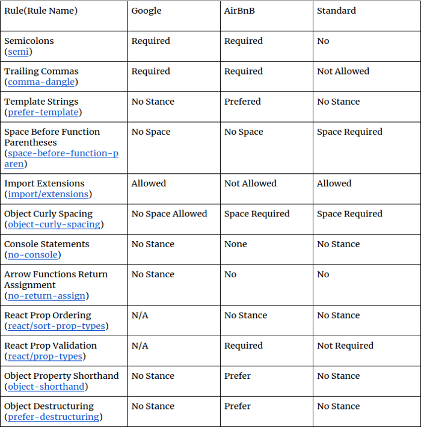

# NLW Valoriza
## Be kind and praise your coworkers


NLW Valoriza is a back-end server that serves to praise your coworkers and give credit. 
This tool was created at Rocketseat's Next Level Week 6 event.

## Features

- Register coworkers
- Register tags (praise)
- Send compliments to coworkers

## Business Rules

- User registration

	- [ ] Is not allowed to register an user with same email
	
	- [ ] Is not allowed to register an user without email
    
- Tag registration

	- [ ] Is not allowed to register a tag with same name
		
	- [ ] Is not allowed to register a tag without name
		
	- [ ] Is not allowed registrations from non admin users

- Compliments registration

	- [ ] Is not allowed an user to register a tag to himself
	
	- [ ] Is not allowed to register a tag to invalid users
	
	- [ ] The user must be authenticated in order to register a tag
	

## Tech

NLW Valoriza uses a number of open source projects to work properly:

- [node.js](https://nodejs.org/) - evented I/O for the backend with JS
- [Express](https://expressjs.com/) - fast web framework for node.js
- [TypeORM](https://typeorm.io/#/) - Object Relational Model framework to work easily with databases
- [sqlite3](https://github.com/mapbox/node-sqlite3) -  lighweight relational database

And of course NLW itself is open source with a [public repository](https://github.com/xandao6/nlw-valoriza) on GitHub.

## Installation

NLW Valoriza requires [Node.js](https://nodejs.org/) v14+ to run.

Install the dependencies and devDependencies and start the server.

```sh
cd nlw-valoriza
yarn
yarn dev
```

## Development

Want to contribute? Awesome!

NLW Valoriza uses some tools to have a consistent and cool code.

- [TypeScript](https://www.typescriptlang.org/) - strongly typed JavaScript
- [ts-node-dev](https://github.com/wclr/ts-node-dev) - hot reloading
- [eslint](https://github.com/eslint/eslint) with [AirBnB config](https://github.com/iamturns/eslint-config-airbnb-typescript) - code quality linter with the opinionated AirBnB config
- [prettier](https://github.com/prettier/prettier) with [eslint plugin](https://github.com/prettier/eslint-plugin-prettier) and [eslint config](https://github.com/prettier/eslint-config-prettier) - formatter linter with eslint integration

More about AirBnB eslint config: 

   - [Style guides trends](https://www.npmtrends.com/eslint-config-airbnb-vs-eslint-config-google-vs-standard)
   - 

To work easily with the sqlite database we recommend to use [BeeKeeper Studio](https://www.beekeeperstudio.io/)

To test the RESTful API we recommend to use [Insomnia](https://insomnia.rest/) or [Postman](https://www.postman.com/)

## Docker

TODO

## License
[](./LICENSE.md)

Free software =)
